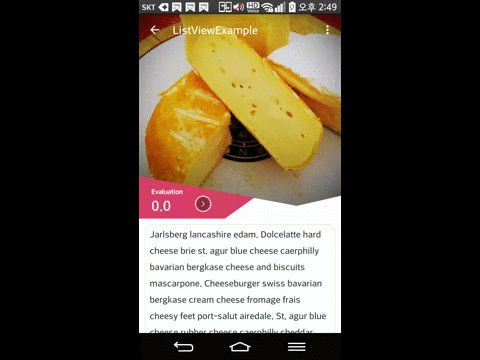

# Material_ParallaxDesign

## 1. Description
    RecylerView와 ListView 사용 시 Bouncing 가능한 View를 만들기 위한 Custom Layout
	
## 2. Requirement
	minSdkVersion 16
		
## 3. Using
	-  ParallaxLayout의 object를 생성한 후 Toolbar를 사용한다면 ParallaxLayout의에 Set 한다 
```java

	private ParallaxLayout	mParallaxLayout;
    private Toolbar toolbar;
    @Override
    protected void onCreate(Bundle savedInstanceState) {
        super.onCreate(savedInstanceState);
        setContentView(R.layout.activity_list_view_example);
        toolbar = (Toolbar) findViewById(R.id.toolbar);
        setSupportActionBar(toolbar);
        getSupportActionBar().setHomeButtonEnabled(true);
        getSupportActionBar().setDisplayHomeAsUpEnabled(true);
        getSupportActionBar().setDisplayShowHomeEnabled(true);

        mParallaxLayout = (ParallaxLayout)findViewById(R.id.contentLayout);
        mParallaxLayout.setToolbar(toolbar);
        
    }

    @Override
    public void onScrollStateChanged(AbsListView view, int scrollState) {
        if(mParallaxLayout !=null)
            mParallaxLayout.onScrollStateChanged(view, scrollState);
    }
    @Override
    public void onScroll(AbsListView view, int firstVisibleItem,int visibleItemCount, int totalItemCount) {
        if(mParallaxLayout !=null)
            mParallaxLayout.onScroll(view, firstVisibleItem,visibleItemCount,totalItemCount);
    }
    @Override
    public boolean dispatchTouchEvent(MotionEvent ev) {
        // TODO Auto-generated method stub
        if(mParallaxLayout !=null)
            mParallaxLayout.onTouchEvent_Gesture(ev);
        return super.dispatchTouchEvent(ev);
    }
```	
	- AbsListView의 OnScroll Event를 ParallaxLayout의 Interface에 연결 시켜 준다.(RecylerView일 경우 OnScrolled)
	- dispatchTouchEvent를 ParallaxLayout의 Interface에 연결 시켜 준다.
 
```xml
	<com.example.ohsu.material_parallaxdesign.parallax.layout.ParallaxLayout
        android:id="@+id/contentLayout"
        android:layout_width="match_parent"
        android:layout_height="match_parent" >

        <RelativeLayout
            android:id="@+id/header_layout"
            android:layout_width="wrap_content"
            android:layout_height="wrap_content">

            <RelativeLayout
                android:layout_width="wrap_content"
                android:layout_height="wrap_content" >
                <ImageView
                    android:id="@+id/imgTop"
                    android:layout_width="match_parent"
                    android:layout_height="364dp"
                    android:src="@drawable/cheese_1"
                    android:scaleType="centerCrop" />
               
            </RelativeLayout>

        </RelativeLayout>
        <RelativeLayout
            android:layout_width="match_parent"
            android:layout_height="match_parent"
            android:id="@+id/content_layout">
            <ListView
                android:id="@+id/list_content"
                android:layout_width="match_parent"
                android:layout_height="match_parent"
                android:divider="#ffffff"
                android:listSelector="@android:color/transparent"
                android:scrollbars="none">
            </ListView>
        </RelativeLayout>

    </com.example.ohsu.material_parallaxdesign.parallax.layout.ParallaxLayout>
	
	- XML소스상 ParallaxLayout의 0번째 Layout이 Header Layout이 되며 1번째 Layout은 content Layout이 된다.
``` 
## 4. Demo
 
 
## 5. License
Copyright (c) 2015 tnrud122

Licensed under the [Apache License, Version 2.0](http://www.apache.org/licenses/LICENSE-2.0.html)
